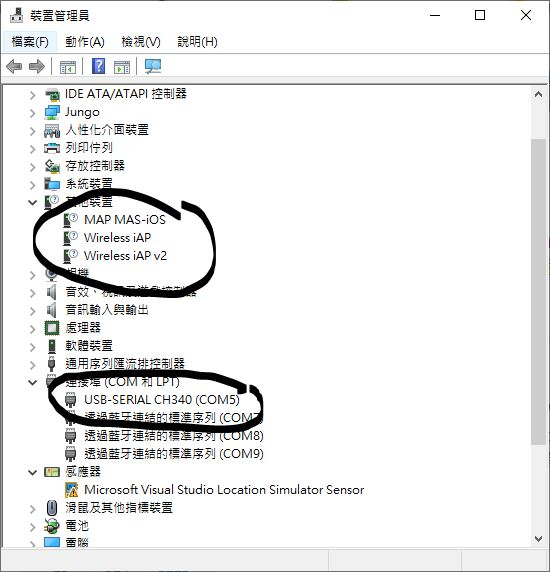

# CP2012_win10_driver
somehting went wrong with the Win10 update and patch, CH340 &amp; CP2102 enumated as other device, not working as serial port anymore !?

  


### CP210x Universal Windows Driver
v11.2.0  
2022/OCT/21  

download the siliconlab driver, manully install the driver following, fixed, but why ?

https://www.silabs.com/developers/usb-to-uart-bridge-vcp-drivers?tab=downloads


### CH340, same issue, why ? fix, download the CHT340ser driver  
CH341SER_3.7.EXE  
v3.7 	
2022-03-02 	
631KB  

https://www.wch.cn/download/CH341SER_EXE.html  
CH340G，CH340T，CH340C，CH340N, CH340K, CH340E，CH340B，CH341A，CH341F, CH341T，CH341B，CH341C，CH341U 	
CH340/CH341 USB转串口WINDOWS驱动程序，支持32/64位Windows 11/10/8.1/8/7/VISTA/XP，SERVER 2022/2019/2016/2012/2008/2003，2000/ME/98，通过微软数字签名认证，支持USB转UART/3线和9线SERIAL串口等，用于随产品发行到最终用户。  


### driver file listing
```
\CP210x_Universal_Windows_Driver_v11.2.0_2022-10-21\arm
\CP210x_Universal_Windows_Driver_v11.2.0_2022-10-21\arm64
\CP210x_Universal_Windows_Driver_v11.2.0_2022-10-21\CP210x_Universal_Windows_Driver_ReleaseNotes.txt
\CP210x_Universal_Windows_Driver_v11.2.0_2022-10-21\list.bat
\CP210x_Universal_Windows_Driver_v11.2.0_2022-10-21\list.txt
\CP210x_Universal_Windows_Driver_v11.2.0_2022-10-21\silabser.cat
\CP210x_Universal_Windows_Driver_v11.2.0_2022-10-21\silabser.inf
\CP210x_Universal_Windows_Driver_v11.2.0_2022-10-21\SLAB_License_Agreement_VCP_Windows.txt
\CP210x_Universal_Windows_Driver_v11.2.0_2022-10-21\x64
\CP210x_Universal_Windows_Driver_v11.2.0_2022-10-21\x86
\CP210x_Universal_Windows_Driver_v11.2.0_2022-10-21\arm\silabser.sys
\CP210x_Universal_Windows_Driver_v11.2.0_2022-10-21\arm64\silabser.sys
\CP210x_Universal_Windows_Driver_v11.2.0_2022-10-21\x64\silabser.sys
\CP210x_Universal_Windows_Driver_v11.2.0_2022-10-21\x86\silabser.sys
```


```
\CH341SER\CH341M64.sys
\CH341SER\CH341PORTS.DLL
\CH341SER\CH341PORTSA64.DLL
\CH341SER\CH341PT.DLL
\CH341SER\CH341PTA64.DLL
\CH341SER\CH341S64.SYS
\CH341SER\CH341S98.SYS
\CH341SER\CH341SER.CAT
\CH341SER\CH341SER.INF
\CH341SER\CH341SER.SYS
\CH341SER\CH341SER.VXD
\CH341SER\DRVSETUP64
\CH341SER\list.bat
\CH341SER\list.txt
\CH341SER\SETUP.EXE
\CH341SER\WIN 1X
\CH341SER\DRVSETUP64\DRVSETUP64.exe
\CH341SER\WIN 1X\CH341M64.sys
\CH341SER\WIN 1X\CH341PORTS.DLL
\CH341SER\WIN 1X\CH341PORTSA64.DLL
\CH341SER\WIN 1X\CH341PT.DLL
\CH341SER\WIN 1X\CH341PTA64.DLL
\CH341SER\WIN 1X\CH341S64.SYS
\CH341SER\WIN 1X\CH341S98.SYS
\CH341SER\WIN 1X\CH341SER.CAT
\CH341SER\WIN 1X\CH341SER.INF
\CH341SER\WIN 1X\CH341SER.SYS
\CH341SER\WIN 1X\CH341SER.VXD
```
